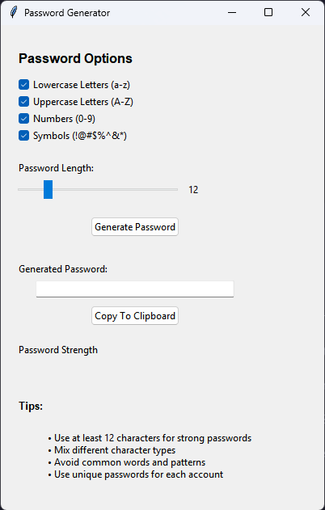

# Secure Password Generator

A cross-platform desktop application for generating secure passwords with a modern, user-friendly interface. Built with Python and Tkinter.



## Features

- 🔐 Generate secure passwords with customizable options
- ✨ Modern, user-friendly interface
- 📋 One-click copy to clipboard
- 🎯 Password strength indicator
- 💪 Customizable password criteria:
  - Lowercase letters (a-z)
  - Uppercase letters (A-Z)
  - Numbers (0-9)
  - Special characters (!@#$%^&*)
- 📏 Adjustable password length (4-50 characters)
- 💻 Cross-platform support (Windows, macOS, Linux)

## Installation

### Download Pre-built Executables

Download the latest release for your operating system from the [Releases](https://github.com/yourusername/password_gen_py/releases) page:

- Windows: `PasswordGenerator.exe`
- macOS: `PasswordGenerator.app`
- Linux: `PasswordGenerator`

### Build from Source

1. Clone the repository:
```bash
git clone https://github.com/AdnanRahmanpoor/password_gen_py.git
cd password_gen_py
```

2. Create a virtual environment (recommended):
```bash
# Windows
python -m venv venv
.\venv\Scripts\activate

# macOS/Linux
python3 -m venv venv
source venv/bin/activate
```

3. Install dependencies:
```bash
pip install -r requirements.txt
```

4. Run the application:
```bash
python password_gen.py
```

### Building Executables

#### Windows
```bash
# Run the build script
.\build.bat
# Find the executable in dist/PasswordGenerator.exe
```

#### macOS
```bash
# Make the build script executable
chmod +x build.sh
# Run the build script
./build.sh
# Find the application in dist/PasswordGenerator.app
```

#### Linux
```bash
# Make the build script executable
chmod +x build.sh
# Run the build script
./build.sh
# Find the executable in dist/PasswordGenerator
```

## Usage

1. Launch the application
2. Select desired password criteria:
   - Choose character types (lowercase, uppercase, numbers, symbols)
   - Adjust password length using the slider
3. Click "Generate Password"
4. Click "Copy to Clipboard" to copy the generated password
5. Check the password strength indicator for security assessment

## Development

### Project Structure
```
password_gen_py/
├── password_gen.py   # Main application file
├── build_config.py        # Build configuration
├── build.py              # Build script
├── build.bat            # Windows build script
├── build.sh            # Unix build script
├── requirements.txt    # Python dependencies
├── icons/             # Application icons
│   ├── password.ico   # Windows icon
│   ├── password.icns  # macOS icon
│   └── password.png   # Linux icon
├── screenshots/       # Application screenshots
└── README.md         # This file
```

### Requirements

- Python 3.7 or higher
- tkinter (usually comes with Python)
- pyperclip
- PyInstaller (for building executables)

## Contributing

1. Fork the repository
2. Create a new branch: `git checkout -b feature-name`
3. Make your changes and commit them: `git commit -m 'Add feature'`
4. Push to the branch: `git push origin feature-name`
5. Submit a pull request

## Security

This password generator uses Python's `random` module with the operating system's source of randomness. While suitable for most purposes, if you need cryptographic randomness, consider modifying the code to use `secrets` module instead.

## License

This project is licensed under the MIT License - see the [LICENSE](LICENSE) file for details.

## Acknowledgments

- Built with [Python](https://python.org/) and [Tkinter](https://docs.python.org/3/library/tkinter.html)
- Packaged with [PyInstaller](https://www.pyinstaller.org/)

## Contact

Adnan Rahmanpoor - [@AdnanRpX](https://twitter.com/adnanrpx)

Project Link: [https://github.com/AdnanRahmanpoor/password_gen_py.git](https://github.com/AdnanRahmanpoor/password_gen_py.git)

## Support

If you find this project helpful, please give it a ⭐️!

Found a bug? Have a feature request? [Open an issue](https://github.com/AdnanRahmanpoor/password_gen_py.git/issues)